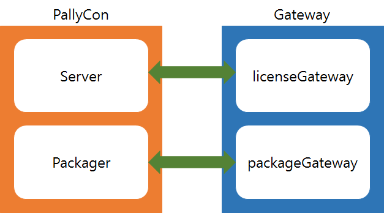

#
Gateway PHP Module API

**( Version 1.0, 2016.08.23 )**

## 1. 개요



PallyCon 서비스 사용 시 pack rule 발급, 라이선스 발급, 어플리케이션 연동에 필요한 Gateway 페이지를 구성할 수 있는 모듈입니다.

1. licenseGateway : 어플리케이션에서 콘텐츠 재생 요청 시 라이센스 발급을 위해 PallyCon 라이선스 서버에서는 licenseGateway 페이지로 license Rule 정보를 요청합니다.
2. packageGateway : 패키져에서 콘텐츠의 DRM 패키징 시 사용될 키 정보를 PallyCon 라이선스 서버에서는 packageGateway 페이지로 키 정보를 요청합니다.

## 2. API

## Class Gateway

gateway로 요청된 데이터의 파싱과 응답 데이터 생성에 사용할 수 있습니다.

### 1. file path

: libs/gateway.asp

### 2. Method

#### Class\_Initialize \(\)

생성자

#### _string_ Function CreateErrorTemplete \( GatewayDTO gatewayDTO \)

error response 규격에 맞춰서 값을 생성한다.

**Parameter**

| type | name | description |
| --- | --- | --- |
| GatewayDTO | gatewayDTO | license rule 발급을 위해 setting 가능한 DTO |

**Return** _string_

_Example_

```
<!--#Include File= "libs/gateway.asp" --><%

Dim requestData

Set obj_Gateway = new Gateway
obj_Gateway.encrypter.Key = "aaaaaaaaaaaaaaaaaaaaaaaaaaaaaaaa"
Set gwDto = new GatewayDTO

gwDto.ErrorCode = "1111"
gwDto.ErrorMessage = "error message."
'암호화된 최종 response value
Response.write "result : " & obj_Gateway.CreateErrorTemplete(gwDto)
'암호화 되기 전 response value
Response.write " before encrypt value : " & gwDto.ErrorInfo

'result : hAAEAnhUkWTyy3D9SedII6J6CSqaoUXg5hj5Gm+tkTu8XZWrADCGINBIup3qL4FKa448aAtYE1hZspQq55oglA==
'before encrypt value : {"error_code":"1111","error_message":"error message"}
%>
```

#### _string_ Function CreateLicenseRule \( GatewayDTO gatewayDTO \)

license rule 연동 response 규격에 맞춰서 값을 생성한다.

**Parameter**

| type | name | description |
| --- | --- | --- |
| GatewayDTO | gatewayDTO | license rule 발급을 위해 setting 가능한 DTO |

**Return** _string_

_Example_

```
<!--#Include File= "libs/gateway.asp" --><%

Dim requestData

Set obj_Gateway = new Gateway
obj_Gateway.encrypter.Key = "aaaaaaaaaaaaaaaaaaaaaaaaaaaaaaaa"
Set gwDto = new GatewayDTO

gwDto.Limit = True

'암호화된 최종 response value
Response.write "result : " & obj_Gateway.CreateLicenseRule(gwDto)
'암호화 되기 전 response value
Response.write " before encrypt value : " & gwDto.LicenseRule

'result : euh3OrEWXGWoJWS4rgy/bvU/6bnIyClZR5tydh0g79AhS1nbh971iJpJuHlrpyaFn79n6P0pqp/56jQrTJPXtMKTJgK+A+jKaLTMMs6/iVSLH+ErVX6bEt65yvV0+g6+wNQtPoxL5cN0K2GGzabJ6ec36jsxgqB8N0Pc4CERnHDlh/6Hau9Tv/rtJTDtqE8K/LU0S0WfhTyV9WGViB8J1IX45pgSi9IdJJnE5jpMXpk92lGh1lIWxnezlwNpfQMzjpDO27BO0mcLhD6+a/Vxavh31lQJ4fUc3/FNUAF61s+CchEdWIOSJ1kV8WqyAdrQ9CMrF5Sft2wkHmrYAM80Tw== 

'before encrypt value : {"error_code":"0000","error_message":"success","nonce":"","playback_policy":{"persistent":false,"limit":true,"duration":0},"security_policy":{"output_protect":{"allow_external_display":false,"control_hdcp":0},"allow_mobile_abnormal_device":false}}

%>
```

#### _string_ Function CreatePackageInfo \( GatewayDTO gatewayDTO \)

package 연동 response 규격에 맞춰서 값을 생성한다.

**Parameter**

| type | name | description |
| --- | --- | --- |
| GatewayDTO | gatewayDTO | license rule 발급을 위해 setting 가능한 DTO |

**Return** _string_

_Example_

```
<!--#Include File= "libs/gateway.asp" --><%

Dim requestData

Set obj_Gateway = new Gateway
obj_Gateway.encrypter.Key = "aaaaaaaaaaaaaaaaaaaaaaaaaaaaaaaa"
Set gwDto = new GatewayDTO

gwDto.Cid = "test-cid"

'암호화된 최종 response value
Response.write "result : " & obj_Gateway.CreatePackageInfo(gwDto)
'암호화 되기 전 response value
Response.write " before encrypt value : " & gwDto.PackInfo

'result : euh3OrEWXGWoJWS4rgy/bvU/6bnIyClZR5tydh0g79AhS1nbh971iJpJuHlrpyaFFd8bs6EmAslPoop+fOjmLRncXxPiE11MKMdI6aiLkeI=

'before encrypt value : {"error_code":"0000","error_message":"success","nonce":"","cid":"test-cid"}

%>
```

#### _sub_ parseRequestLicense \(String\)requestData, \(GatewayDTO\)gatewayDTO

license rule 연동 시 request data를 파싱 처리 한다.

**Parameter**

| type | name | description |
| --- | --- | --- |
| string | requestData | license rule 정보 요청을 위해 gateway 로 전달되어온 data parameter 값 |
| GatewayDTO | gatewayDTO | license rule 발급을 위해 setting 가능한 DTO |

_Example_

```
<!--#Include File= "libs/gateway.asp" --><%

Dim requestData

Set obj_Gateway = new Gateway
obj_Gateway.encrypter.Key = "aaaaaaaaaaaaaaaaaaaaaaaaaaaaaaaa"
Set gwDto = new GatewayDTO

'data parameter : {\"user_id\": \"test-user\",\"cid\":\"DEMOtest-cid\",\"oid\": \"\",\"nonce\": \"3426u3050329384g\", \"drm_type\": \"widevine\"}
'encrypt -> yFuWBkRWkW1TTXKC9ZzEAy4/R0WekL0R3yxmmUM21xhcsM0cM4gDr1qsoWExaClhjwDERbucx5tZrPVc2c+wIVyybexs0E6T8HCIZyXjOyYWBqAv03HDbi6x3G+tZdAsHyKK3+42G0eEiOIPAoZTmA==

requestData = "yFuWBkRWkW1TTXKC9ZzEAy4/R0WekL0R3yxmmUM21xhcsM0cM4gDr1qsoWExaClhjwDERbucx5tZrPVc2c+wIVyybexs0E6T8HCIZyXjOyYWBqAv03HDbi6x3G+tZdAsHyKK3+42G0eEiOIPAoZTmA=="

obj_Gateway.ParseRequestLicense requestData, gwDto

Response.write "user_id : " & gwDto.UserId & "<br/>"
Response.write "cid : " & gwDto.Cid & "<br/>"
Response.write "oid : " & gwDto.Oid & "<br/>"
Response.write "nonce : " & gwDto.Nonce &"<br/>"
Response.write "drm_type : " & gwDto.DrmType & "<br/>"


'user_id : test-user
'cid : DEMOtest-cid
'oid :
'nonce : 3426u3050329384gㅌ
'drm_type : widevine

%>
```

#### _sub_ ParseRequestPackage \(String\)requestData, \(GatewayDTO\)gatewayDTO

package 연동 시 request data를 파싱 처리 한다.

**Parameter**

| type | name | description |
| --- | --- | --- |
| string | requestData | pack 정보 요청을 위해 gateway 로 전달되어온 data parameter 값 |
| GatewayDTO | gatewayDTO | license rule 발급을 위해 setting 가능한 DTO |

_Example_

```
<!--#Include File= "libs/gateway.asp" --><%

Dim requestData

Set obj_Gateway = new Gateway
obj_Gateway.encrypter.Key = "aaaaaaaaaaaaaaaaaaaaaaaaaaaaaaaa"
Set gwDto = new GatewayDTO

'data parameter : {\"file_name\": \"sample-content.mp4\",\"file_path\":\"/cont/sample1/sample-content.mp4\",\"nonce\": \"3426u3050329384g\"}
'encrypt -> gru+GTVi4nAGukble2dHWmkXBbJf8hphGf+Wtnt0h9duJKjzPWoctlGk0YCPD3bgcof3GeKvkwjBpZpidC9WgJp4oVPsnXSUzG9bJn8gqBXMZBG4l114/Y8vj6zYibNkF7gW7mOO6uwkv1aKhMe1tA==
requestData = "gru+GTVi4nAGukble2dHWmkXBbJf8hphGf+Wtnt0h9duJKjzPWoctlGk0YCPD3bgcof3GeKvkwjBpZpidC9WgJp4oVPsnXSUzG9bJn8gqBXMZBG4l114/Y8vj6zYibNkF7gW7mOO6uwkv1aKhMe1tA=="

obj_Gateway.ParseRequestPackage requestData, gwDto

Response.write "file_name : " & gwDto.FileName & "<br/>"
Response.write "filePath : " & gwDto.FilePath & "<br/>"

'file_name : sample-content.mp4
'file_path : /cont/sample1/sample-content.mp4

%>
```

## Class GatewayDTO

gateway 와의 통신에 필요한 data 객체. getter와 setter로 구성되어 있다.

### 1. file path

: libs/gatewayDTO.asp

### 2. Method

#### *Getter & Setter*

#### *bool* AllowExternalDisplay

#### *bool* AllowMobileAbnormalDevice

#### *string* Cid

#### *string* ControlHdcp

#### *string* DeviceId

#### *string* DeviceType

#### *string* DrmType

#### *string* Duration

#### *string* ErrorCode

#### *string* ErrorInfo

#### *string* ErrorMessage

#### *string* ExpireDate

#### *string* FileName

#### *string* FilePath

#### *bool* HardwareDrm

#### *string* HlsAesKey

#### *string* HlsAesIv

#### *bool* Limit

#### *string* LicenseRule

#### *string* MpegCencKey

#### *string* MpegCencKeyId

#### *string* MpegCencIv

#### *string* NcgCek

#### *string* Nonce

#### *string* Oid

#### *string* PackInfo

#### *bool* Persistent

#### *string* ResponseUserId

#### *string* UserId


